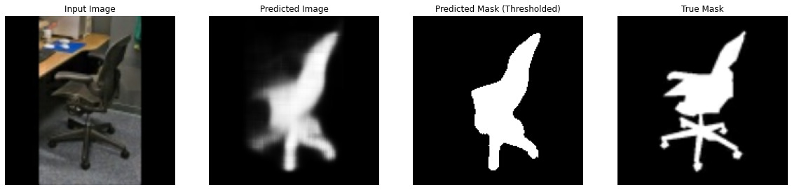
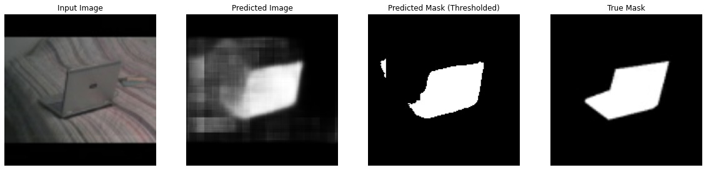
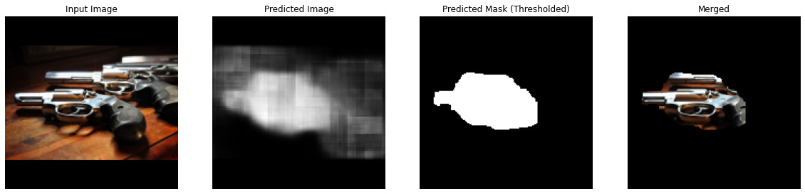

[![Contributors][contributors-shield]][contributors-url]
[![Forks][forks-shield]][forks-url]
[![Stargazers][stars-shield]][stars-url]
[![Issues][issues-shield]][issues-url]
[![MIT License][license-shield]][license-url]
[![LinkedIn][linkedin-shield]][linkedin-url]

<!-- PROJECT LOGO -->
<br />
<p align="center">
    

  <h2 align="center">Any Object Background Subtractor (Unseen Object Segmentation)</h2>

  <p align="center">
    A Lightweight Custom Foreground Segmentation Model Trained on Modified COCO.
    <br />
    <a href="https://nbviewer.org/github/animikhaich/single-object-background-subtractor/blob/main/Test_Images.ipynb">Results Notebook</a>
    ·
    <a href="https://github.com/animikhaich/single-object-background-subtractor/issues/new">Report Bug</a>
  </p>
</p>
<p align="center">
  
</p>
<!-- TABLE OF CONTENTS -->

## Table of Contents

- [Table of Contents](#table-of-contents)
- [About The Project](#about-the-project)
- [Jupyter Notebooks - nbViewer](#jupyter-notebooks---nbviewer)
- [Dataset Information](#dataset-information)
- [Dataset Preprocessing](#dataset-preprocessing)
- [Results](#results)
  - [Masks for Validation Set from COCO (Contains same classes to that in the training set)](#masks-for-validation-set-from-coco-contains-same-classes-to-that-in-the-training-set)
  - [Inference Results on a Collected Dataset of Guns from Google (A class similar to this was not present in the COCO dataset)](#inference-results-on-a-collected-dataset-of-guns-from-google-a-class-similar-to-this-was-not-present-in-the-coco-dataset)
- [How to Run](#how-to-run)
  - [Hardware Used for the Experiment](#hardware-used-for-the-experiment)
  - [Dataset Directory Structure (For Training)](#dataset-directory-structure-for-training)
  - [Built With](#built-with)
- [Changelog](#changelog)
- [Contributing](#contributing)
- [License](#license)
- [Contact](#contact)
    - [Animikh Aich](#animikh-aich)

<!-- ABOUT THE PROJECT -->

## About The Project

While working on synthetic data generation (Like Cut, Paste and Learn: [ArXiv Paper](https://arxiv.org/abs/1708.01642)), one of the many challenges that I faced was an easy way to extract the foreground object of interest from the background image. Having worked with simple UNet-like ([Paper](https://arxiv.org/abs/1505.04597)) architectures in the past, I wanted to test out a hypothesis that an Autoencoder should be able to learn to differentiate foreground from background objects and if trained on enough variety, it would be able to do the same for unseen objects as well (classes it has not seen during training).

The goal was to train an efficient end-to-end CNN capable of segmenting out the foreground objects, even for classes that are not present in the training set.

Even though I have used COCO dataset for this experiment, there is a good amount of preprocessing that has been done to convert the dataset to a format that suites the need. Hence, if you want to replicate it, be sure to check that part out.

In summary: the results are quite impressive as the model clearly displays potential to accurately extract foreground objects, both for seen and unseen classes. Please on to find out more!

The notebooks do not render properly on GitHub, hence please use the [nbviewer](https://nbviewer.jupyter.org/) links provided below to see the results.

## Jupyter Notebooks - nbViewer

- [Dataset Preparation - Extracting the per-object masks from the COOC dataset](https://nbviewer.jupyter.org/github/animikhaich/single-object-background-subtractor/blob/main/Dataset_Preparation.ipynb)
- [Model - Model Notebook containing Data Loader and Architecture: Training](https://nbviewer.jupyter.org/github/animikhaich/single-object-background-subtractor/blob/main/Model.ipynb)
- [Results/Testing - Test Results on Validation Set and a collection of Gun Images from Google](https://nbviewer.jupyter.org/github/animikhaich/single-object-background-subtractor/blob/main/Test_Images.ipynb)

## Dataset Information

- The Model is trained on [COCO 2017 Dataset](https://cocodataset.org/).
- Dataset Splits Used:
  - Train: COCO 2017 Train Images + Train Annotations - `instances_train2017.json`
  - Val: COCO 2017 Val Images + Val Annotations - `instances_val2017.json`
- Dataset Download: https://cocodataset.org/#download
- Dataset Format Information: https://cocodataset.org/#format-data
- API to parse COCO: https://github.com/philferriere/cocoapi

## Dataset Preprocessing

- COCO contains instance segmentation annotations, and that was the primary reason behind selecting this dataset.
- We do not want to have more than one segmentation mask in a given image since our aim is to build network capable of segmenting out the foreground object.
- We thus process the dataset to crop out the surrounding region of each instance segmentation and save that image and the corresponding mask for that instance as training inputs and targets respectively.
- Though this does create quite a few bad samples of data, they have been deliberately been left in the dataset to add some noise elements to the dataset and because this is just an experimental project (It was almost morning and I was sleepy, got lazy).

## Results

- There are two sets of results:
  - **First:** Results from the Validation Set of the COCO Dataset (after preprocessing). This contains data from classes which the model has already seen before (present in the training set). For example, dog, human, car, cup, etc.
  - **Second:** The most interesting results are of that class which the model has never seen before (not present in training set). To test that out, I collected a few variety of images of guns from Google Image, and passed them through the network for inference.

I'll let the results speak for itself.

### Masks for Validation Set from COCO (Contains same classes to that in the training set)

Images (Left to Right): `Input Image`, `Predicted Image`, `Thresholded Mask @ 0.5`, `Ground Truth Mask`








### Inference Results on a Collected Dataset of Guns from Google (A class similar to this was not present in the COCO dataset)

Images (Left to Right): `Input Image`, `Predicted Image`, `Thresholded Mask @ 0.5`, `Masked Background (Segmented Object)`





## How to Run

The experiment should be fairly reproducible. However, a GPU would be recommended for training. For Inference, a CPU System would suffice.

### Hardware Used for the Experiment

- CPU: AMD Ryzen 7 3700X - 8 Cores 16 Threads
- GPU: Nvidia GeForce RTX 2080 Ti 11 GB
- RAM: 32 GB DDR4 @ 3200 MHz
- Storage: 1 TB NVMe SSD (This is not important, even a normal SSD would suffice)
- OS: Ubuntu 20.10

Alternative Option: [Google Colaboratory - GPU Kernel](https://colab.research.google.com/)

### Dataset Directory Structure (For Training)

- Use the COCO API to extract the masks from the dataset. (Refer: [Dataset Preparation.ipynb Notebook](https://nbviewer.jupyter.org/github/animikhaich/single-object-background-subtractor/blob/main/Dataset_Preparation.ipynb))
- Save the masks in a directory as `.jpg` images.
- Example Directory Structure:

```sh
.
├── images
│   ├── train
│   │   ├── *.jpg
│   └── val
│       └── *.jpg
└── masks
│   ├── train
│   │   ├── *.jpg
│   └── val
│       └── *.jpg
```

### Built With

Simple List of Deep Learning Libraries. The main Architecture/Model is developed with Keras, which comes as a part of Tensorflow 2.x

- [Tensorflow 2.5.0](https://www.tensorflow.org/)
- [OpenCV 4.5.1.48](https://opencv.org/)
- [Numpy 1.19.5](https://numpy.org/)
- [Matplotlib 3.3.4](https://matplotlib.org/)
- [PyCOCOTools 2.0.2](https://github.com/philferriere/cocoapi)


## Changelog

Since this is a Proof of Concept Project, I am not maintaining a CHANGELOG.md at the moment. However, the primary goal is to improve the architecture to make the predicted masks more accurate.


## Contributing

Contributions are what make the open source community such an amazing place to be learn, inspire, and create. Any contributions you make are **greatly appreciated**.

1. Fork the Project
2. Create your Feature Branch (`git checkout -b feature/AmazingFeature`)
3. Commit your Changes (`git commit -m 'Add some AmazingFeature'`)
4. Push to the Branch (`git push origin feature/AmazingFeature`)
5. Open a Pull Request

## License

Distributed under the Copyleft License: GNU AGPL v3. See [LICENSE](LICENSE) for more information.

## Contact

#### Animikh Aich

- Website: [Animikh Aich - Website](http://www.animikh.me/)
- LinkedIn: [animikh-aich](https://www.linkedin.com/in/animikh-aich/)
- Email: [animikhaich@gmail.com](mailto:animikhaich@gmail.com)
- Twitter: [@AichAnimikh](https://twitter.com/AichAnimikh)

<!-- MARKDOWN LINKS & IMAGES -->

[contributors-shield]: https://img.shields.io/github/contributors/animikhaich/single-object-background-subtractor.svg?style=flat-square
[contributors-url]: https://github.com/animikhaich/single-object-background-subtractor/graphs/contributors
[forks-shield]: https://img.shields.io/github/forks/animikhaich/single-object-background-subtractor.svg?style=flat-square
[forks-url]: https://github.com/animikhaich/single-object-background-subtractor/network/members
[stars-shield]: https://img.shields.io/github/stars/animikhaich/single-object-background-subtractor.svg?style=flat-square
[stars-url]: https://github.com/animikhaich/single-object-background-subtractor/stargazers
[issues-shield]: https://img.shields.io/github/issues/animikhaich/single-object-background-subtractor.svg?style=flat-square
[issues-url]: https://github.com/animikhaich/single-object-background-subtractor/issues
[license-shield]: https://img.shields.io/github/license/animikhaich/single-object-background-subtractor.svg?style=flat-square
[license-url]: https://github.com/animikhaich/single-object-background-subtractor/blob/master/LICENSE.md
[linkedin-shield]: https://img.shields.io/badge/-LinkedIn-black.svg?style=flat-square&logo=linkedin&colorB=555
[linkedin-url]: https://linkedin.com/in/animikh-aich/
[product-screenshot]: assets/face-blur-demo.gif
